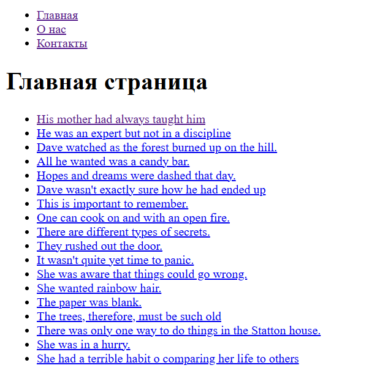

# навигация при помощи React router dom

Проект представляет собой одностраничное приложение (SPA), которое использует библиотеку React Router DOM для маршрутизации и навигации между страницами. В проекте реализованы следующие страницы:

- Главная страница 
- Страница "О нас" 
- Страница "Контакты" 
- Страница для отображения подробной информации о посте 
- Страница 404 
- Кроме того, страницы обернуты в общий компонент Layout, который содержит навигационное меню.